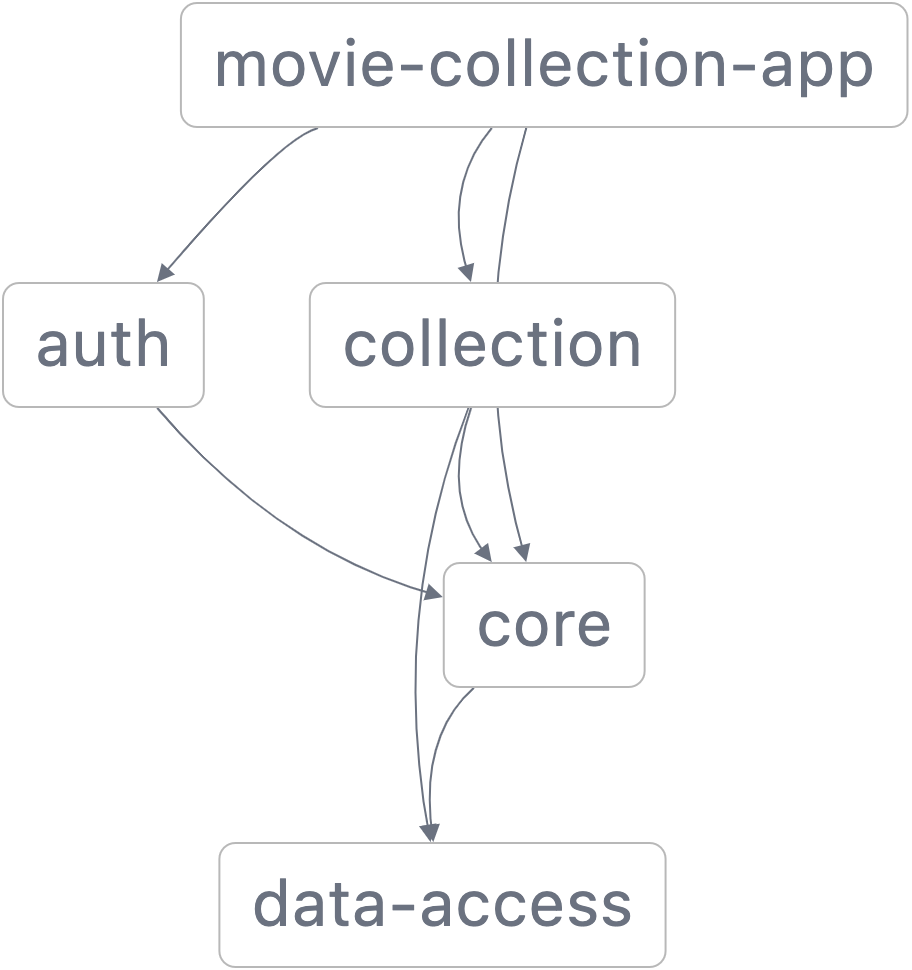

# Readme

## Running the app

### Docker

The easiest way is by using Docker. Just run this:

```
make docker-run
```

### Manually

To run it in your local env, you have to:

- Install Node 16 (https://nodejs.org/en/download/)

Then run these commands in order,

- `npm install` (Install dependencies)
- `npm run start` (Starts the app in the dev server)

## How to use

You can list and inspect collections without logging in. You have to log in to do write operations.

## App Structure

The project consists of four libs and one app.

<p style="text-align: center;"></p>

### app/movie-collection-app

The main app which bootstraps the whole project. It also defines the app shell and registers lazy loaded feature
modules.

### libs/data-access

Defines http clients to communicate with the backend REST API.

### libs/core

Contains injectables that are used both by the libs and the app itself.

### libs/auth

Contains services and components to handle login and register operations.

### libs/collection

Contains services and components to handle collection and movie related operations.

## Notes

- It expects the backend to be available at http://localhost:8080.
- Dumb components do not have unit tests since they do not contain logic. They are usually tested visually with Storybook.
- The aim was to write unit tests for all smart components and services. However, some didn't receive due to time
  constraints.
- HTTP error cases are largely ignored due to time constraints.
